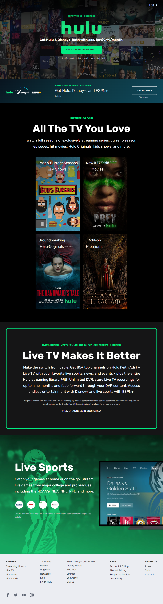

# Hulu Website Clone
Homepage do streaming Hulu

## Sobre o Projeto
Projeto de HTML | CSS | JavaScript com finalidades acadêmicas e didáticas.

## Processo de Criação

- HTML5 Semântico
- CSS3
- JavaScript
- Flex Box
- CCS Grid
  

## Imagens do Projeto
---
 **Mobile**

**Leptop**

---

## Referências
 - [Traversy Media](https://www.youtube.com/@TraversyMedia)
